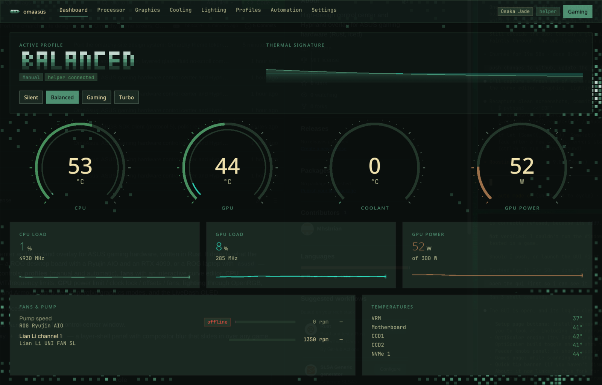
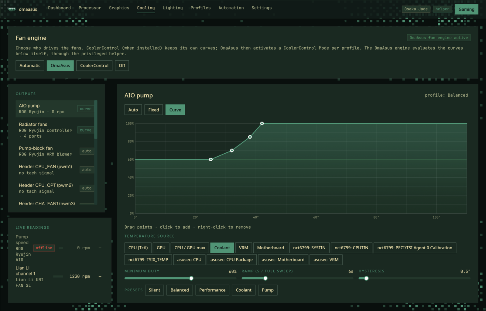
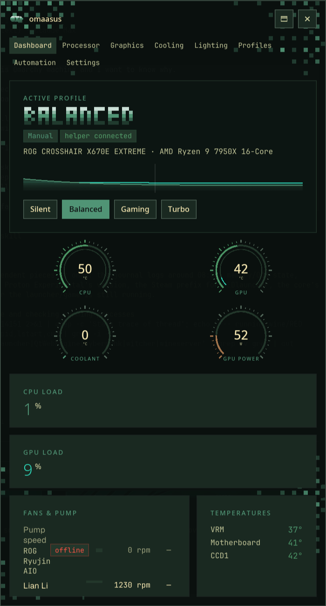
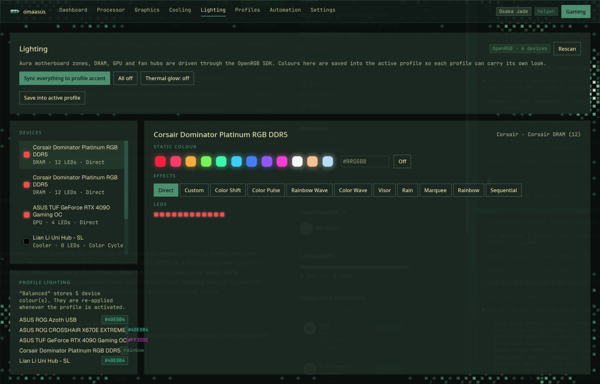

<p align="center">
  
</p>

<h1 align="center">OmaAsus</h1>

<p align="center">
  A control center and Hyprland overlay for ASUS gaming hardware, in Rust.<br>
  Profiles, fans, CPU, GPU, lighting, automation. Designed in the <a href="https://omarchy.org">Omarchy</a> visual system and skinned by your active Omarchy theme.
</p>

<p align="center">
  <a href="#install">Install</a> ·
  <a href="#what-it-controls">What it controls</a> ·
  <a href="#design">Design</a> ·
  <a href="#architecture">Architecture</a> ·
  <a href="#cli">CLI</a> ·
  <a href="#safety">Safety</a>
</p>

---

## Why

Windows has Armoury Crate. Linux has a dozen excellent daemons that each own one piece: `asusd` for ROG laptops, CoolerControl for fans, OpenRGB for lights, `power-profiles-daemon` for platform power, NVML for the GPU. OmaAsus is the one surface over all of them. It detects what your machine actually is, a ROG desktop board with an AIO and a discrete card, or a ROG laptop with `asusd`, and shows only the controls that exist, with a single privileged helper doing the root work behind polkit.

It runs as a normal window and as a **layer-shell overlay** you toggle over any game with one key.

## What it controls

| Page | Controls |
|---|---|
| **Dashboard** | Active profile, quick switch, thermal signature, CPU/GPU/coolant/power gauges, load sparklines, fans and pump with live/stale/offline state, board temperatures |
| **Processor** | Governor, energy-performance preference, core boost, SMT, frequency ceiling and floor, per-core clocks and load with preferred-core ranking |
| **Graphics** | NVIDIA power limit, locked core clock, core and memory clock offsets (driver 555+ NVML API), manual fan speed, persistence mode, throttle reasons; amdgpu DPM performance level |
| **Cooling** | Fan engine ownership (OmaAsus / CoolerControl / firmware), per-output modes (auto, fixed, software curve, hardware Smart Fan IV curve), an interactive curve editor with hysteresis and ramp limiting, temperature-source picker, presets, live readings |
| **Lighting** | Every OpenRGB device: static colour, per-LED direct mode, built-in effects, off, "sync everything to the profile", thermal glow; colours saved per profile |
| **Profiles** | Create, duplicate, rename, recolour, delete, set default; each profile bundles power profile, CPU, GPU, cooling, lighting and a CoolerControl Mode |
| **Automation** | Manual or automatic mode; rules on GameMode, fullscreen game, window class, process name, CPU/GPU temperature, time of day; priorities and hold times |
| **ASUS** *(laptops)* | `asusd` platform profile, PPT limits and other Armoury firmware attributes, charge limit, `supergfxd` graphics mode with a desktop safety guard |
| **Settings** | Helper install, CoolerControl credentials, overlay anchor/size/opacity, telemetry rate, LiveDash OLED text, detected-hardware report |

<p align="center">
  
</p>

### Hardware it understands

- **Desktop boards**: Nuvoton Super I/O headers through `nct6775` (including programming the firmware's own Smart Fan IV curves), `asus-ec-sensors`, ASUS Aura USB controllers, the LiveDash OLED on ROG Extreme boards.
- **Coolers**: ROG Ryujin II/III through the kernel `rog_ryujin` driver; Lian Li UNI FAN hubs (SL, SL-Infinity, SL v2, AL v2) over HID.
- **GPUs**: NVIDIA through NVML, AMD through amdgpu sysfs.
- **CPUs**: cpufreq with `amd-pstate-epp` and `intel_pstate`, k10temp / coretemp, RAPL package power when readable.
- **Laptops and ROG Ally**: `asusd` (`xyz.ljones.*` interfaces, asusctl 6.x) and `supergfxd`.
- **Daemons it cooperates with**: CoolerControl (REST), OpenRGB (native SDK client, protocol 5), power-profiles-daemon, Feral GameMode, Hyprland IPC.

Everything is optional. A device that stops answering is quarantined and shown as offline instead of freezing the app.

## Design

The interface is a port of [omarchy-site](https://github.com/omacom/omarchy-site)'s design system, taken from its stylesheet and components rather than approximated:

- **Geist** for headings and controls, **JetBrains Mono** for navigation, labels, values and copy.
- The site's token roles: `bg-deep`, `bg`, `surface`, `surface-2`, `border-subtle`/`strong`, `text`/`secondary`/`muted`, `brand`, `brand-ink`, and the five field bands. Zero corner radius. Opaque surfaces with a one-pixel elevation ring. Brand-filled primary buttons.
- **Your Omarchy theme drives the colours.** On start, OmaAsus asks `omarchy-theme-current` and reads that theme's `colors.toml`, mixing intermediate shades exactly the way the site does. Change theme, restart, and the app follows.
- The background is the site's **pixel field** as a GPU shader: 10 px cells, Bayer-dithered drifting blobs, corner clustering, a cursor halo, and a subtle pulse with system load.
- The active profile is set in the site's **3×5 pixel glyph font** with the five brand bands, and the header carries the `oma` mark.
- Every page is a **single-screen composition**: rows share height proportionally and the type scale follows the window. Nothing scrolls except long lists inside their own card.

<p align="center">
  
  &nbsp;&nbsp;
  
</p>

## Install

Requirements: Rust 1.98+, Wayland, a Vulkan-capable GPU, Hyprland for the overlay and automation signals. Arch is the tested platform.

```sh
git clone https://github.com/Mhsbrian/OmaAsus
cd OmaAsus
cargo build --release
```

Binaries land in `target/release`: `omaasus` (GUI), `oma-helper` (root service), `oma` (diagnostics). A `PKGBUILD` is in `packaging/`.

### The helper

Fans, governors, GPU limits and lighting controllers live behind root-only sysfs and hidraw nodes. OmaAsus ships one small system service, `com.omaasus.Helper1`, gated by polkit:

- `com.omaasus.helper.control` — routine tuning (fans, governor, EPP, power limits, platform profile). Allowed for the active local session without a prompt, like power-profiles-daemon.
- `com.omaasus.helper.advanced` — clock offsets, SMT, raw device writes. Asks for your password once per session.

Install it from **Settings → Install helper** (runs through `pkexec`), or by hand:

```sh
sudo scripts/install-helper.sh target/release/oma-helper crates/oma-helper/data
```

That installs the binary, D-Bus policy, polkit actions, the systemd unit, and udev rules giving your user access to Aura, Ryujin, Lian Li and LiveDash devices.

The service is started on demand by D-Bus the first time OmaAsus asks for it, not at boot. Its device allow-list names driver groups (`char-nvidia`, `char-hidraw`, …) rather than `/dev` paths, because a path that does not exist yet when the unit starts is silently dropped, and the NVIDIA nodes can appear seconds after the driver loads. If a profile ever reports `cannot open the GPU through NVML`, `systemctl restart oma-helper` is the fix.

### Hyprland

Hyprland 0.56+ (Lua config), append to `~/.config/hypr/bindings.lua`:

```lua
o.bind("SUPER + F12", "OmaAsus overlay", hl.dsp.exec({ cmd = "omaasus toggle" }))
o.bind("SUPER + CTRL + G", "Gaming profile", hl.dsp.exec({ cmd = "omaasus profile gaming" }))
-- Omarchy dims every window to 0.985/0.96 opacity; keep OmaAsus opaque:
o.window({ title = "^OmaAsus$" }, { opacity = "1 1" })
```

Older Hyprland: see `packaging/hyprland.conf`. Start the overlay daemon at login with the user unit in `packaging/omaasus.service`:

```sh
systemctl --user enable --now omaasus
```

### Tray

OmaAsus registers a StatusNotifierItem, so Omarchy's bar shows the `oma` mark in its tray. Closing the main window then leaves the daemon running: automation rules, the fan engine and the overlay keep working, and the icon is the way back.

| Click | Action |
| --- | --- |
| Left | Drop the panel down under the bar (click again to fold it up) |
| Middle | Open the main window |
| Right | Menu: window, panel, profile switch, quit |

The panel slides and settles with its own animation; Hyprland's `layersIn`/`layersOut` fades layer on top. The icon is symbolic, so the bar recolours it to the current theme. A package installs it under `/usr/share/icons/hicolor`; a `cargo` build drops a user copy into `~/.local/share/icons/hicolor` on first start. Turn the tray off under Settings if your bar has no StatusNotifier host, and closing the window exits as before.

### Optional integrations

- **CoolerControl**: if its daemon is running, OmaAsus delegates fan curves to it by default and activates a CoolerControl *Mode* per profile. Enter the CCAdmin password under Settings.
- **OpenRGB**: start `openrgb --server` (or press the button on the Lighting page). The client speaks the SDK protocol natively.
- **GameMode**: registered games trigger automation rules.

## Architecture

```
crates/
  oma-hw/      unprivileged hardware layer (no root needed to read anything)
               hwmon · cpufreq/amd-pstate · NVML (+ raw clock offsets) · amdgpu
               Lian Li HID · LiveDash OLED · CoolerControl REST · OpenRGB SDK
               asusd / supergfxd / power-profiles-daemon / GameMode proxies
               Hyprland IPC · profile model · software fan engine
  oma-helper/  root D-Bus service, polkit-gated, sysfs allow-list, NVML apply
  oma-gui/     omaasus — iced 0.14 + iced_exwlshell: window + layer-shell overlay,
               pixel-field shader, curve editor, automation engine, session IPC
  oma-cli/     oma — inventory, sensors, watch, nvidia, cpu, daemons, rgb
research/      the D-Bus and protocol references the implementation was built from
```

The GUI never touches hardware from its UI thread. A sampler thread produces telemetry frames into a persistent registry (channels are live, stale, or offline, never missing), and every write goes through the helper or a blocking task.

## CLI

```
omaasus                       open the window (also starts the overlay daemon)
omaasus --overlay             start headless; the overlay waits for a toggle
omaasus toggle | show | hide  control the overlay from a keybind
omaasus window                open the window (starts the app if nothing runs)
omaasus profile <name>        apply a profile by name
omaasus page <name>           jump to a page
omaasus quit                  stop the daemon and drop the tray item

oma inventory [--json]        what was detected
oma sensors                   every hwmon reading
oma watch [secs]              live CPU/GPU line
oma nvidia | cpu | daemons | rgb
```

## Safety

- The helper writes only allow-listed sysfs attributes and ASUS/ENE HID devices; anything else is refused before polkit is consulted.
- GPU clock offsets apply to the P0 VF curve. Start small and validate stability.
- On desktops without an internal panel, `supergfxd`'s Integrated mode is never offered; it would unbind your display GPU.
- Releasing a fan output restores the saved `pwm_enable` mode on board headers, returns GPU fans to automatic, and re-enables PWM sync on Lian Li channels. The Ryujin falls back to a safe fixed duty.
- Stalled devices are quarantined for a minute rather than allowed to block the app.
- A profile is a complete GPU state: one that names no power limit restores the card's stock limit, so a Quiet profile's cap never follows you into Gaming.
- CPU boost is written per policy where the kernel offers it. power-profiles-daemon restores boost per policy when it leaves power-saver, and a global boost of 0 makes that fail, which used to break every Quiet → Balanced switch.
- Closing the window only keeps the daemon alive while a bar actually hosts the tray item; without one, closing still exits so nothing runs invisibly.

## Status

Built and verified on a ROG Crosshair X670E Extreme with a Ryzen 9 7950X, an RTX 4090, a ROG Ryujin II 360 and a Lian Li UNI FAN hub, running Arch with Omarchy. Laptop paths (`asusd`, `supergfxd`) are implemented from the current interface definitions but have not been exercised on hardware yet.

## License

MIT.
